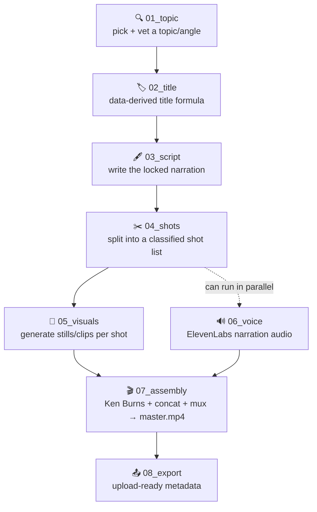

# longform_stickman_arragned

**AI-narrated ink/stickman explainer videos, built stage by stage.**

Pick a topic → write a script that decides the story → break it into a
shot list → generate the visuals → generate the voice → assemble → export.

**This file is an index, not a manual.** Each pipeline stage has its own
doc, right next to its own code, in `system/<NN_stage>/`. Read this file
for setup; read [`pipeline.md`](pipeline.md) for the workflow's full order
and reasoning; read a stage's own doc when you're actually working on that
stage; read [`CLAUDE.md`](CLAUDE.md) for cross-cutting conventions.

## How it flows



`06_voice` only depends on `03_script`'s locked script — not on
`04_shots`/`05_visuals` — so it can run any time after the script locks, in
parallel with shot-building/visual-generation, even though the stages are
listed in their usual run order above. See [`pipeline.md`](pipeline.md) for
the full reasoning.

## Setup

**1. Install ffmpeg** — needed from `07_assembly` onward for anything
touching audio/video:

| OS | Command |
|---|---|
| macOS | `brew install ffmpeg` |
| Ubuntu / Debian | `sudo apt install ffmpeg` |
| Arch | `sudo pacman -S ffmpeg` |

Confirm: `ffprobe -version` should print something.

**2. Set up the visuals pipeline venv** (only needed for the automated
Gemini API path — the manual Flow/browser-extension path works without it):
```
python3.11 -m venv system/05_visuals/.venv
source system/05_visuals/.venv/bin/activate
pip install -r system/05_visuals/requirements.txt
```
Needs `GEMINI_API_KEY` in `.env` at the repo root (already present,
gitignored).

## The pipeline, stage by stage

| Stage | Doc | Input → Output |
|---|---|---|
| `01_topic/` | [topic.md](system/01_topic/topic.md) | a rough idea → a vetted, locked topic (no file — conversational) |
| `02_title/` | [title.md](system/02_title/title.md) | locked topic → 2-3 title candidates |
| `03_script/` | [structure.md](system/03_script/structure.md), [persona.md](system/03_script/persona.md) | locked title/topic → locked `script.md` |
| `04_shots/` | [shot.md](system/04_shots/shot.md), [character.md](system/04_shots/character.md) | locked `script.md` → `shot_list.md` |
| `05_visuals/` | [generate_visuals.py](system/05_visuals/generate_visuals.py) | `shot_list.md`'s prompts → generated stills/clips |
| `06_voice/` | [voice.md](system/06_voice/voice.md) | locked `script.md` → narration audio (manual, ElevenLabs) |
| `07_assembly/` | [assembly.md](system/07_assembly/assembly.md), [assemble.py](system/07_assembly/assemble.py) | shots + audio → `<slug>_v1.mp4` |
| `08_export/` | [export.md](system/08_export/export.md) | final render → upload-ready metadata |

`04_shots`/`05_visuals` are Claude Code **agents** (`shot-list-builder`,
`visual-generator`) — dispatched isolated for bulky/mechanical work.
`01_topic`/`02_title`/`03_script` are **skills** — run conversationally in
the same session. `06_voice`/`07_assembly`/`08_export` have no dedicated
specialist yet.

## Sister project

`../movie_auto_narration_fb/workflow_space/` is the project this repo's
`system/<NN_stage>/` layout and `pipeline.md` split were modeled on — a
different content style (real-footage movie recaps vs. fully-generated
stickman explainers), but the same underlying idea: one authoritative
pipeline doc, one numbered stage folder per pipeline step, each stage's own
doc living next to its own code.
