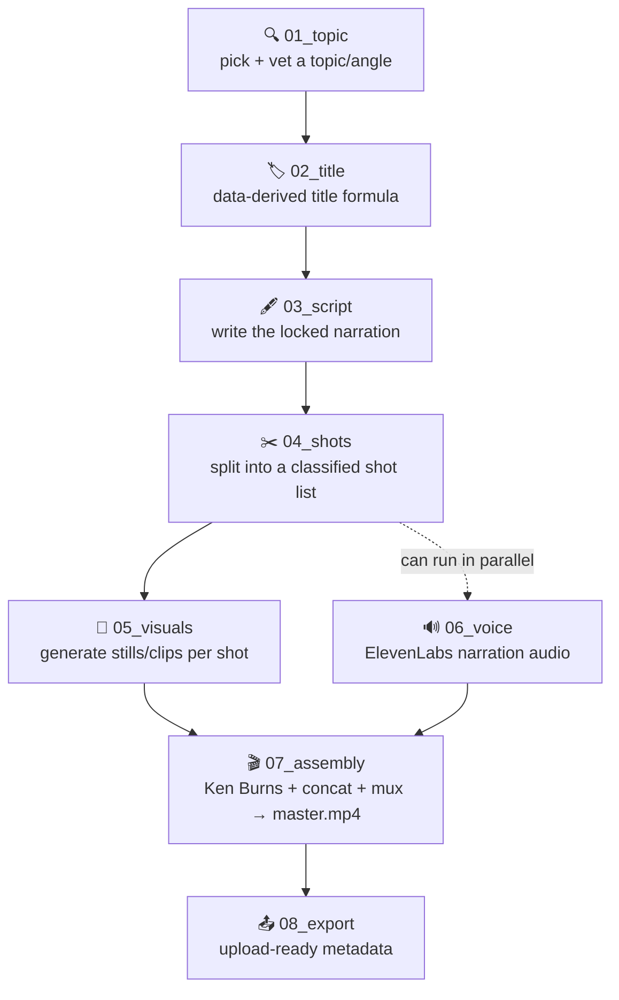

<div align="center">

# 🖋️ longform_stickman_arragned

**An 8-stage pipeline that turns a topic idea into a rendered, research-backed ink/stickman explainer video — script, shots, visuals, voice, and assembly, each stage documented and mostly automated.**


</div>

---

## Highlights

- **Claude Code skills + agents split, not one monolithic script.** Early
  story-decision stages (`topic-scout`, `title-writer`, `script-writer`) run
  as conversational skills; bulky/mechanical stages (`shot-list-builder`,
  `visual-generator`) run as isolated agents that report back a summary
  instead of filling the conversation. `.claude/skills/` and `.claude/agents/`
  hold the actual specialist configs.
- **Shot lists are built programmatically and verified, not hand-typed.**
  `shot-list-builder` splits a locked script into clause-level shots, then
  diffs the reconstructed narration against the source script byte-for-byte
  before writing anything downstream — this caught real drift in past runs,
  not a theoretical safeguard.
- **Character-consistency is handled with a real reference-image set and
  model routing, not just prompt text.** `generate_visuals.py` routes
  `character`-tagged shots to `gemini-3-pro-image-preview` with up to 5
  attached reference images (front/action/expression poses from
  `generate_character_reference.py`), while `diagram`/`environment` shots
  stay on the cheaper flash model — reference images are never forced onto
  shots that shouldn't have a character in them.
- **Assembly is a real ffmpeg pipeline, not a manual CapCut step (though that
  stays a valid fallback).** `assemble.py` applies a per-shot randomized Ken
  Burns pan/zoom, synthesizes tick SFX and an ambient pad in pure Python (no
  external audio library), and idempotently skips shots that already have a
  rendered clip so a re-run only redoes what changed.
- **The reference docs are living post-mortems, not static specs.**
  `character.md` and `shot.md` document real failures from past batches
  (a 47%-wrong image batch from a browser-extension queue-desync bug, a
  character-style drift across an otherwise-identical prompt) and the actual
  fixes applied — read as project history, not just rules.
- **One video fully rendered end-to-end, one more mid-production with a
  documented punch list.** `videos/001-toba-supervolcano/` has a finished
  render + thumbnail; `videos/002-built-to-starve/` has a rough assembly with
  known, tracked issues (see `CLAUDE.md`'s video tracker) rather than a
  silently-abandoned attempt.

## How it works



`06_voice` only depends on `03_script`'s locked script, not on
`04_shots`/`05_visuals` — it can run any time after the script locks, in
parallel with shot-building/visual-generation, even though the diagram lists
stages in their usual run order. See [`pipeline.md`](pipeline.md) for the
full reasoning and a real status table of what's automated vs. manual vs.
still broken per stage.

**The core design decision**: every stage's reference doc lives right next
to that stage's own code, under one numbered `system/<NN_stage>/` folder —
there's no separate "docs" tree drifting out of sync with the scripts it
describes. The tradeoff this project leans into deliberately is treating
video production with software-engineering discipline rather than as a
content checklist: shot lists get diffed against source scripts before
they're trusted, image batches get hash-checked for duplicates before
they're trusted, and every fix to a recurring bug (character drift,
invented on-screen text, a queue-desync bug in a third-party batch tool)
gets written back into the relevant doc so the next run doesn't repeat it.
Prompts are also deliberately self-contained (style baked into the prompt
text itself) rather than relying on a shared reference image across a whole
batch, because the browser batch-extension tool this project uses only
supports one global reference image per batch — forcing a character
reference onto batches that also contain character-free diagram/environment
shots would corrupt those shots. See
[`system/04_shots/shot.md`](system/04_shots/shot.md)'s "Primary method"
section for the full reasoning.

## Setup

1. **Install ffmpeg** — needed from `07_assembly` onward for anything
   touching audio/video:

   | OS | Command |
   |---|---|
   | macOS | `brew install ffmpeg` |
   | Ubuntu / Debian | `sudo apt install ffmpeg` |
   | Arch | `sudo pacman -S ffmpeg` |

   Confirm with `ffprobe -version`.

2. **Set up secrets.** Copy `.env.example` to `.env` at the repo root and
   fill in real values — `.env` is gitignored, never committed.

   | Key | Needed for | Where to get it |
   |---|---|---|
   | `GEMINI_API_KEY` | The automated `05_visuals` image/video generation path only (`generate_visuals.py`, `generate_character_reference.py`). Not required for the manual Flow/browser-extension path. | [Google AI Studio](https://ai.google.dev) — billed, no free tier on image/video generation |

3. **Set up the visuals pipeline venv** (only needed for the automated
   Gemini API path):
   ```
   python3.11 -m venv system/05_visuals/.venv
   source system/05_visuals/.venv/bin/activate
   pip install -r system/05_visuals/requirements.txt
   ```
   Requires Python 3.11+ specifically — the system default `python3` on some
   machines is older and missing language features this code uses.

4. **Run the pipeline through Claude Code.** `01_topic` through `03_script`
   are invoked as skills (`/topic-scout`, `/title-writer`, `/script-writer`)
   in a live conversation; `04_shots` and `05_visuals` are dispatched as
   agents (`shot-list-builder`, `visual-generator`). `06_voice`, `07_assembly`,
   and `08_export` have no dedicated specialist yet — run `assemble.py`
   directly for assembly (see its own doc below), and the rest is manual.

## The pipeline, stage by stage

| Stage | Doc | Input → Output |
|---|---|---|
| `01_topic/` | [topic.md](system/01_topic/topic.md) | a rough idea → a vetted, locked topic (no file — conversational) |
| `02_title/` | [title.md](system/02_title/title.md) | locked topic → 2-3 title candidates |
| `03_script/` | [structure.md](system/03_script/structure.md), [persona.md](system/03_script/persona.md) | locked title/topic → locked `script.md` |
| `04_shots/` | [shot.md](system/04_shots/shot.md), [character.md](system/04_shots/character.md) | locked `script.md` → `shot_list.md` |
| `05_visuals/` | [generate_visuals.py](system/05_visuals/generate_visuals.py) | `shot_list.md`'s prompts → generated stills/clips |
| `06_voice/` | [voice.md](system/06_voice/voice.md) | locked `script.md` → narration audio (manual, ElevenLabs) |
| `07_assembly/` | [assembly.md](system/07_assembly/assembly.md), [assemble.py](system/07_assembly/assemble.py) | shots + audio → `<slug>_v1.mp4` |
| `08_export/` | [export.md](system/08_export/export.md) | final render → upload-ready metadata |

## Caveats

- **No free tier on the automated visuals path.** Image generation via the
  Gemini API runs roughly $0.067/image on the default flash model, more on
  the higher-quality model now used for character shots specifically, and
  meaningfully more per clip for video generation — see
  [`shot.md`](system/04_shots/shot.md)'s "Real cost" section for current
  numbers before running a full batch. The manual Flow web-app path is free
  but slower and not automatable.
- **A finished image batch is not a correct one.** A third-party browser
  batch-extension used for the manual path has a documented queue-desync bug
  that silently duplicated and dropped shots in a real production run
  (47% of one video's batch came back wrong). Always hash-check for
  duplicates and spot-check content against `shot_list.md`'s own prompts
  before trusting a batch — see `shot.md`'s "Post-batch verification"
  section.
- **Assembly's duration sync is an approximation, not a real one.** There's
  no per-word narration timestamp data (the voice stage is fully manual), so
  `assemble.py` scales documented shot durations proportionally to match the
  real audio length rather than retiming against actual speech. See
  `assembly.md`'s "Known limitation" section.
- **Character visual consistency is an open, actively-worked problem.** Past
  batches have drifted off the locked stick-figure design even on identical
  prompt text. The current fix (a multi-image reference set + a
  higher-tier model for character shots) is implemented but not yet verified
  against a real batch — see `character.md`'s research section.
- **Generated media is gitignored.** A fresh clone will not include any
  rendered video, generated image, or audio file under `videos/` — those are
  large binaries produced locally, not tracked in git.
