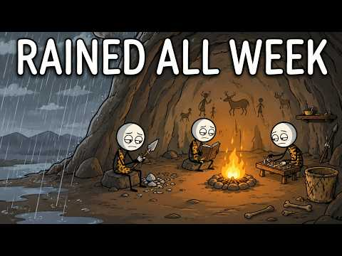
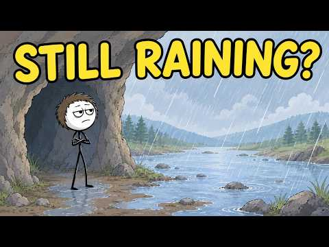
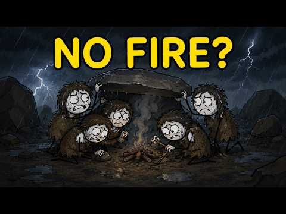
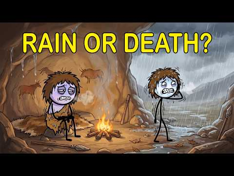
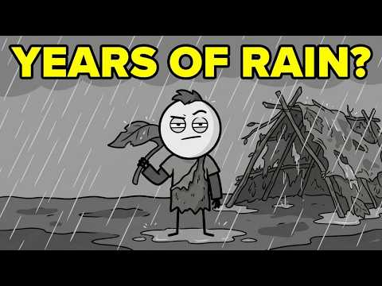
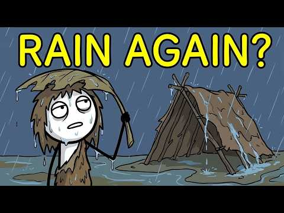

# Niche landscape report — "ink/stickman" prehistoric-survival explainer channels

_Compiled 2026-08-04 via YouTube search + oEmbed lookups. See "Data limitations" at the bottom before treating any number here as solid._

## Headline finding: the exact benchmark video is already being cloned

Searching for the benchmark video ("What Did Ancient Humans Do When It Rained All Week?") surfaced **six different small channels** that each published a near-identical "ancient humans survive endless rain" video within roughly the last month:

| Channel | Handle | Video title | Thumbnail |
|---|---|---|---|
| Deep Epoch | [@DeepEpoch-c3c](https://www.youtube.com/@DeepEpoch-c3c) | What Did Ancient Humans Do When It Rained All Week? |  |
| Before The Clock | [@BeforeTheClock-2D](https://www.youtube.com/@BeforeTheClock-2D) | What Did Ancient Humans Do When It Rained All Week? (same title, different channel) |  |
| Before Civilization | [@BeforeCivilization-01](https://www.youtube.com/@BeforeCivilization-01) | How Did Ancient Humans Keep Fire Alive in Endless Rain? / How Did Ancient Humans Sleep Through Endless Rain? (at least 2 videos in the series) |  |
| Stick Plot | [@StickPlotExplains](https://www.youtube.com/@StickPlotExplains) | How Did Cavemen Survive When It Rained for Days? |  |
| Brook Explains | [@BrookExplains-p2q](https://www.youtube.com/@BrookExplains-p2q) | How Did Ancient Humans Survive Years of Endless Rain? |  |
| Mack (Mack Explains) | [@MackExplains7](https://www.youtube.com/@MackExplains7) | How Did Ancient Humans Survive Endless Rain? |  |

**Correction (superseded, kept for the record):** this report originally said "Ink Explainer" didn't resolve to a real channel because `@InkExplainer` (no suffix) returned nothing. That was wrong — the real handle is **`@Inkexplainer96`** (44,800 subscribers), and its own upload of this exact title has 1.07M views, which strongly suggests *it's* the original and Deep Epoch/the others below are the clones, not the reverse. Full breakdown: [`2026-08-04_inkexplainer96_deep_dive.md`](2026-08-04_inkexplainer96_deep_dive.md).

The channel-name pattern (`Before Civilization`, `Before The Clock`, `Brook Explains`, `Mack Explains`, `Stick Plot Explains`) plus the auto-generated handle suffixes (`-01`, `-2D`, `-p2q`, `-c3c`) strongly suggest a wave of brand-new, low-subscriber channels all iterating on the same viral formula around the same time — likely templated/AI-assisted production. This is a **crowded sub-angle right now**, not an untapped one.

## Actual visual style (confirmed from real thumbnails, not just described)

All six thumbnails above share the same recognizable look — this is the real "stickman" style, more specific than the generic term suggests:

- **Characters:** plain pale/round heads with minimal facial features (dot eyes, simple mouth line), messy scribble hair, thin stick-like limbs and torso, wearing simple fur/hide clothing. Not full silhouettes — faces and expressions are visible and slightly exaggerated (tired, worried, deadpan).
- **Backgrounds:** fully rendered/painted, not simplified — detailed rain, cave interiors, firelight, rivers, tree lines. The contrast between crude stickman characters and a richly painted environment is the signature look.
- **Lighting:** dramatic — dark stormy exteriors, warm firelight interiors, blue-grey rain palettes.
- **Thumbnail text:** short (2-4 words), bold sans-serif, yellow or white, almost always phrased as a question ("NO FIRE?", "RAIN OR DEATH?", "STILL RAINING?", "YEARS OF RAIN?").

Reference images saved to `assets/references/images/` (filenames match the table above).

## Other channels in/near this niche (broader search, not part of the rain-video cluster)

| Channel | What it is | How close a style match |
|---|---|---|
| [Stickman History](https://www.youtube.com/@StickmanHistory) | Self-described "Good History, Bad Art" — general Anglosphere history (empires, battles, notable people), deliberately crude stick-figure art, comedic tone | Same character style family, but broader topics and a comedic rather than immersive/dramatic tone — different feel from the target genre |
| [History of Humankind](https://www.youtube.com/@HistoryofHumankind) | From David Kelly (History of the Universe/Earth) + TV producer Andrew Dixon. Human evolution & social-behavior history | Not a stickman/ink visual style (more documentary-style narration) — but same subject-matter niche (early human history) and reportedly a very high views-per-video ratio for its size, worth watching as a topic/format benchmark even though the visuals differ |
| [Surviving Earth](https://www.youtube.com/channel/UCy_KRFwHRxmxTu5vqkZfubw) | Ancient history / early humans / cinematic survival tales, faceless | Same subject niche (prehistoric survival), visual style unconfirmed — worth checking directly |
| Prehistoric Tales Hub | AI-generated content on how early humans lived/survived/adapted | Same subject niche, AI-production angle — visual style unconfirmed |
| The Infographics Show | Large, established faceless explainer channel — history, science, military, survival, crime, comparisons | Much bigger production tier, flat "infographic" animation style rather than ink/stickman — useful as a scale reference for what a mature faceless channel looks like, not a style match |
| TED-Ed, Weird History, TEDx Talks, National Geographic, Professor Dave Explains | Surfaced by recommendation-engine "similar channels" tools as algorithmically close to the benchmark | All established, high-production-value brands — not real style/scale peers for a new channel, skip as direct competitive reference |

## Data limitations — read before trusting any number above

- **No verified subscriber/view counts.** YouTube channel pages are fully JavaScript-rendered, so automated fetching only returns the page footer — actual stats never loaded. SocialBlade blocked automated requests outright (403).
- What's confirmed is only what YouTube's public oEmbed API and search-result snippets exposed: video titles, channel names/handles, and thumbnail images (via `i.ytimg.com`, which is a plain static image host and did load).
- If exact subscriber/view numbers matter for a go/no-go decision on an angle, check the channels manually in a browser (all handles are linked above) rather than trusting anything inferred here.

## Takeaway for our channel

- The "ancient humans forced indoors by weather" angle from the original benchmark teardown is **already saturated** by at least six near-simultaneous clones. Don't script this exact angle — pick a different "forced constraint" scenario (the format itself, per `assets/brain/format/structure.md`, generalizes to any forced downtime: drought, isolation, famine, volcanic winter, etc.) or a genuinely different evidence set.
- The stickman visual style is real and consistent across independent channels (see thumbnails) — safe to use as our own art-direction reference, it's clearly a working convention for this content type, not just one channel's quirk.
- Thumbnail convention worth copying: short bold question-phrase text (2-4 words, yellow/white) over a dramatic painted scene.
